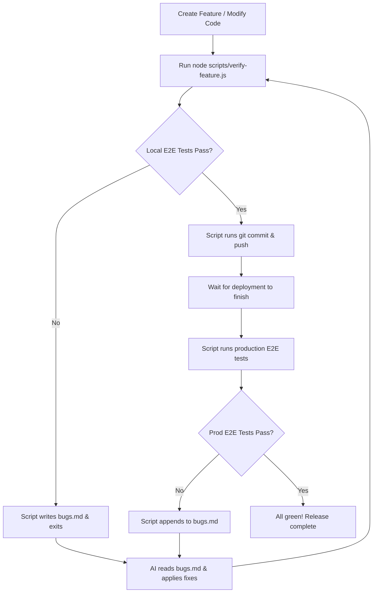

# Automated E2E Verification & CI/CD Hotfix Loop

Vently is equipped with a premium, closed-loop E2E verification script (`scripts/verify-feature.js`) designed to automate testing, bug capturing, git commit/push, and deployment smoke-testing.

This makes co-authoring features with your AI assistant extremely seamless, secure, and fast.

---

## The Workflow Loop



---

## Pipeline Stages

### Stage 1: Local E2E Verification
The pipeline runs your local Playwright test suites (`pnpm --filter @vently/web test:e2e`).
- **If tests fail**: It parses the console logs, extracts the exact names of the failing test specs and error details, and saves/appends them into a beautifully structured `bugs.md` in the project root. It then exits.
- **If tests pass**: It moves cleanly to Stage 2.

### Stage 2: Staging & Committing (Git)
Once local E2E verification succeeds, it detects your current git status and unstaged files.
- If changes are present, it automatically stages them (`git add .`).
- It commits them with a standardized message stating feature checks passed.

### Stage 3: Remote Push
It determines your current Git branch (e.g. `main` or a feature branch) and pushes the branch to your GitHub remote (`git push origin <branch>`).

### Stage 4: Deployment Smoke-Testing
It prompts you with a stylized countdown in the terminal to wait for the Vercel/Railway build to finish deploying.
- Once the deployment is live, type `ok` and press Enter.
- It automatically executes production-targeted Playwright tests (`pnpm --filter @vently/web test:agent`) directly against the live URL: `https://vently-web-gamma.vercel.app`.
- If any production bugs are caught, they are immediately written to `bugs.md` for hotfixing.

---

## Quick Start Command

To kick off the automated loop, run this simple command from the project root:

```bash
node scripts/verify-feature.js
```

---

## Benefits of the Hotfix Loop

- **Zero Manual Logs Parsing**: No need to read through hundreds of lines of Playwright logs — the script puts failures directly in a clear `bugs.md` table.
- **AI Integration**: You can tell Antigravity, *“Run the verification pipeline, read `bugs.md` to see what failed, apply the fixes, and repeat until the pipeline is green.”* Antigravity will handle the whole process autonomously!
- **Production Safety**: Double-verifying in both local and production environments ensures no regression ever reaches real users.
